<div align="center">

# Base Coffee

**A motion landing page for a neighbourhood coffee shop on Road No. 46, Jubilee Hills, Hyderabad.**

[basecoffee.in](https://basecoffee.in) · [@basecoffeeindia](https://www.instagram.com/basecoffeeindia/) · open since May 2025

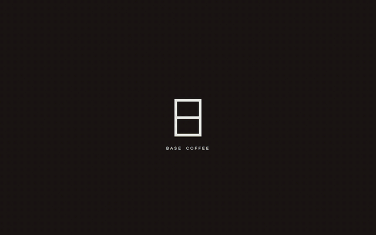

*The whole page is built from the café's own Instagram — 21 clips and 4 photos, nothing stock.*

</div>

---

## Contents

- [What this is](#what-this-is)
- [The three motion beats](#the-three-motion-beats)
- [The pages](#the-pages)
- [Brand, reverse-engineered](#brand-reverse-engineered)
- [Asset pipeline](#asset-pipeline)
- [Architecture](#architecture)
- [Performance](#performance)
- [What is deliberately absent](#what-is-deliberately-absent)
- [Running it](#running-it)
- [Deploying](#deploying)
- [Traps worth knowing](#traps-worth-knowing)

---

## What this is

A single-page site, dark and cinematic: near-black ground, the café's own footage
full-bleed, cream type over the top. Archivo carries the structure, Instrument
Serif italic carries the warm lines.

It is a **spec build**. The design, the copy and every frame of media come from
Base Coffee's public Instagram. It carries their real name, logo and photographs.

| | |
|---|---|
| **Stack** | Next.js 15.5 (App Router, `output: 'export'`), React 19 |
| **Motion** | `motion` v12 (Framer Motion), Lenis for inertial scroll |
| **Styling** | Plain CSS with custom properties — no Tailwind |
| **Type** | Archivo + Instrument Serif, self-hosted via `next/font` |
| **Host** | Static export behind Caddy + nginx on a Hostinger VPS |
| **Weight** | 43 MB built · **1.98 MB on first paint** |

---

## The three motion beats

The page has exactly three, and that restraint is the point. Award-bait sites
stack ten; this one picks three and executes them properly.

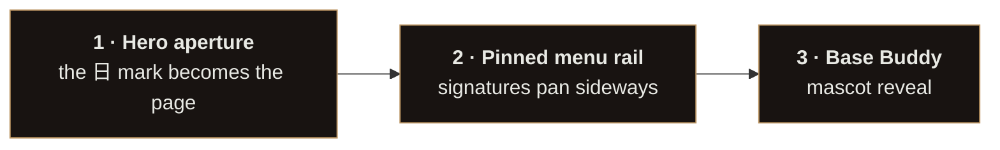

### 1 · Hero aperture

The brand mark is a 日 glyph — a portrait rectangle split in half by a bar. So the
mark *becomes* the page: it holds as a logo lockup, grows to fill the viewport,
then its centre bar tears in two and the footage pours out through the gap.

```mermaid
gantt
    title Hero intro — one 2.6s timeline, phases deliberately overlapping
    dateFormat x
    axisFormat %S.%Ls
    tickInterval 500millisecond
    section Mark
    holds as a logo lockup      :0, 470
    grows to fill the viewport  :470, 1930
    section Bar
    tears in half, gap widens   :1090, 2600
    section Page
    frame fades, headline rises :1920, 2600
```

Two things made this harder than it looks:

- **The stroke must never distort.** A transform-scaled div would squash the
  border, so the geometry is computed in real viewport pixels every frame.
- **It must not cause layout shift.** The first version animated
  `left/top/width/height` on a positioned div — that reflows a viewport-sized box
  every frame and the browser scores it as layout shift. It was the page's
  *entire* CLS: **0.446**. Rewritten as a single full-viewport `<svg>` with
  animated `<rect>`s, where geometry changes never touch document layout, it is
  now **0**. SVG strokes straddle the path where a div's border-box does not, so
  each rect is inset by half a stroke to land on the same pixels.

### 2 · Pinned menu rail

On desktop the Signatures section pins and the five cards pan horizontally. The
pan distance is measured off the rail's own `scrollWidth` rather than guessed in
`vw`, so it lands exactly on the final card at every width.

**Below 780px it stacks instead.** Measured on a 390px phone, the pinned version
cost *3.4 viewports of vertical scroll* to deliver 1130px of sideways motion, one
card at a time, under a label reading "Scroll →" — an arrow pointing at an axis a
finger cannot use.

Pin-plus-drag was rejected for a concrete reason, not taste: `useScroll` →
`useTransform` and motion's `drag="x"` write the same `x` MotionValue, so page
scroll would yank the rail out from under the finger.

### 3 · Base Buddy

The mascot is officially called **Base Buddy** and is printed on every cup. The
one piece of page chrome — a 日 in the corner that fills with coffee as you scroll —
doubles as the scroll indicator, so it earns its place twice.

---

## The pages

| | |
|:--|:--|
| 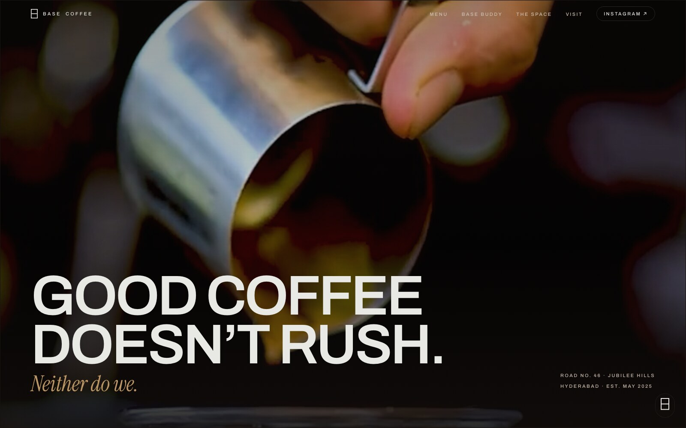 | **Hero** — the aperture beat resolves into full-bleed footage, headline, and the address. |
| 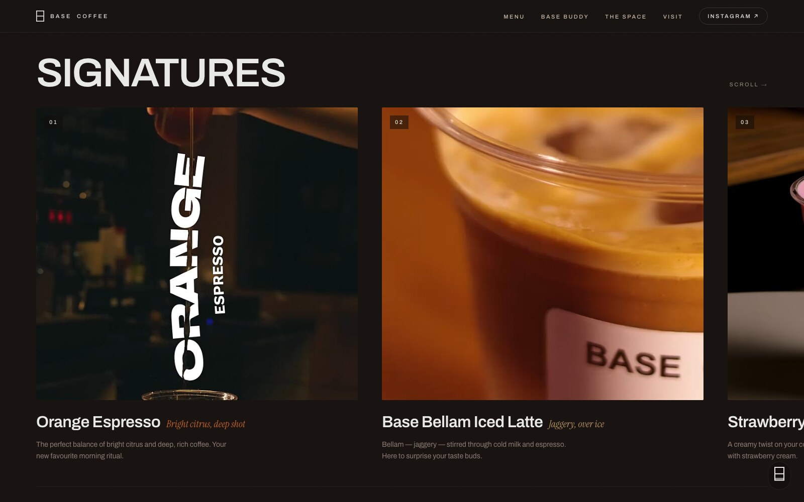 | **Signatures** — Orange Espresso, Base Bellam Iced Latte, Strawberry Cream Cold Brew, Base Matcha, Yogurt Granola Bowl. |
| 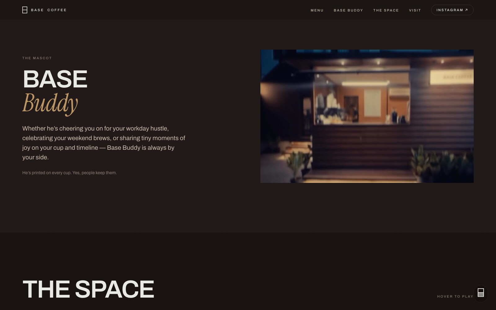 | **Base Buddy** — the mascot, in the café's own words. |
| 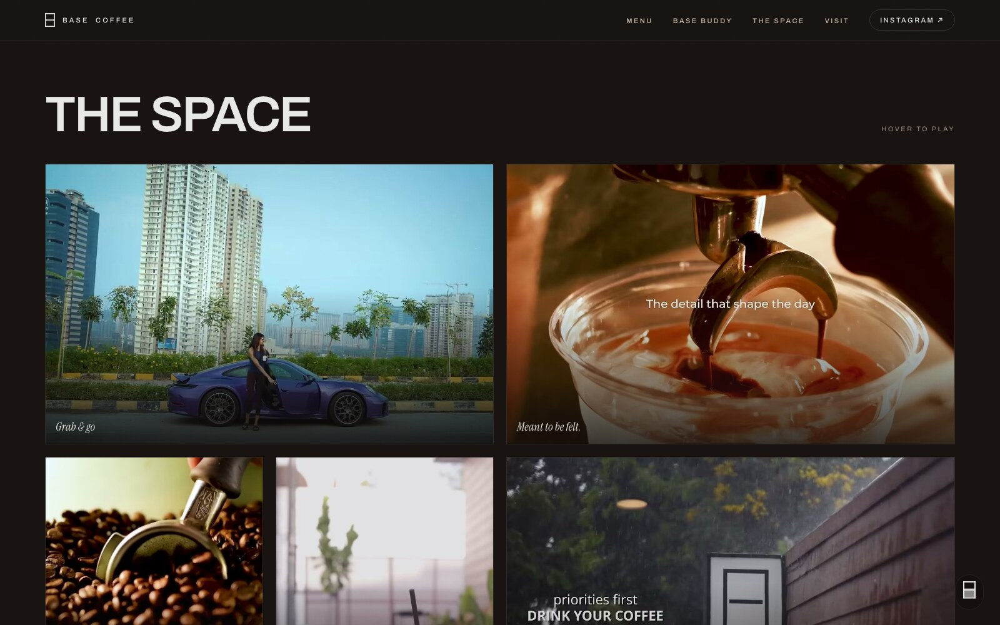 | **The Space** — 16 hover-to-play tiles, each captioned with the café's own line. |
| 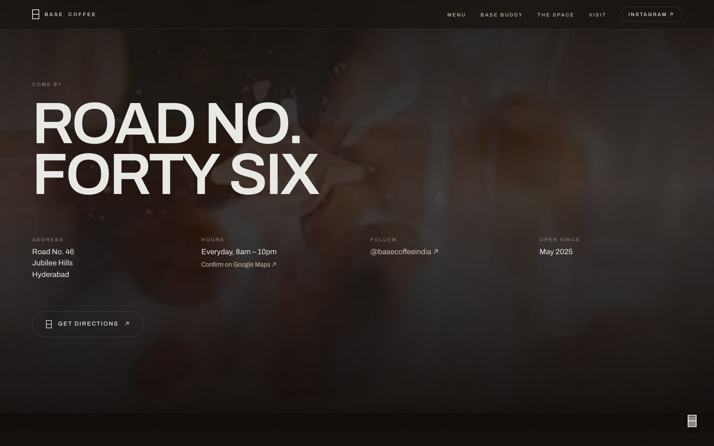 | **Visit** — address, hours, directions. |
| 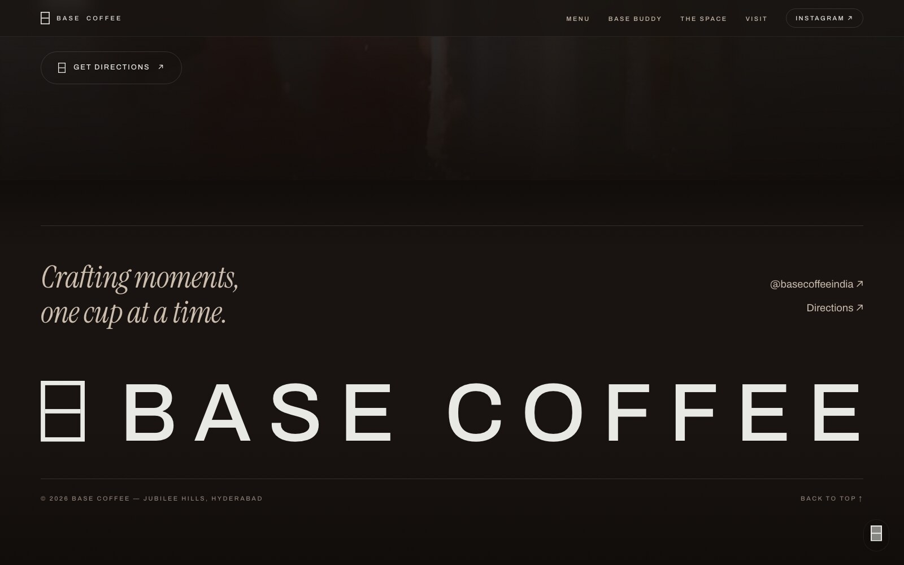 | **Footer** — a gutter-to-gutter closing lockup. |

### On a phone

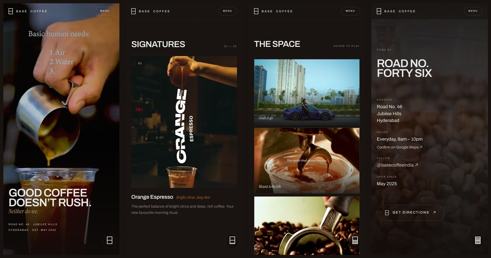

---

## Brand, reverse-engineered

Base publishes no brand kit, so the identity was measured off their posts.

### The mark

The 日 glyph was reconstructed at the pixel level from a 1080px post: a portrait
rectangle **50 × 69**, stroke **10% of width**, and a bar of the same weight
splitting it *exactly* in half. It is rebuilt as SVG in
[`components/Mark.jsx`](components/Mark.jsx) — no raster crop anywhere.

```
        50 units
   ┌──────────────┐  ─┐
   │              │   │
   │              │   │
   ├──────────────┤   │ 69 units      stroke = 5 units (10% of width)
   │              │   │               bar sits dead centre
   │              │   │
   └──────────────┘  ─┘
```

### Palette

Sampled directly from their footage.

| Token | Hex | Use |
|---|---|---|
| `--ink` | `#100c0a` | deepest ground, beneath the video |
| `--ground` | `#181311` | page ground |
| `--ground-2` | `#201917` | raised panels |
| `--cream` | `#E8E9E4` | primary type |
| `--greige` | `#CCBDAE` | secondary type |
| `--mute` | `#8A7C72` | labels |
| `--caramel` | `#BB9563` | accent |
| `--burnt` | `#A25526` | accent |
| `--espresso` | `#562F1E` | accent |

### Voice

Every line on the site is Base's own writing, lifted from their captions or from
words burned into the clips themselves. Nothing was copywritten for them.

> *"Good coffee doesn't rush."* · *"Meant to be felt."* · *"Grab & go"* ·
> *"Life's messy. Coffee first, chaos later."* · *"Crafting moments, one cup at a time."*

---

## Asset pipeline

Instagram will not hand over a media library, so the pipeline reconstructs one.

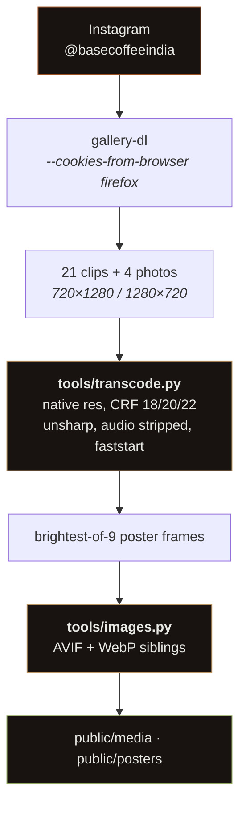

### Why each step exists

**`gallery-dl`, not `yt-dlp`.** yt-dlp cannot enumerate an Instagram profile at
all. gallery-dl can, with browser cookies. The `/reels` tab enumerates reliably;
the `/posts` tab intermittently 401s past page one — and carousels never appear
in `/reels`, which is how a three-video carousel went missing on the first pass.

**Never scale.** Instagram serves at most 1280 on the long edge, so the source
resolution *is* the target. An earlier pass downscaled every vertical clip
720×1280 → 540×960 and cut bitrate to a third; one clip was *upscaled* to
1280×854 while losing two thirds of its bitrate — the worst of both. Everything
is now encoded at native resolution.

**CRF tiered by prominence.** The hero plays full-bleed and is the only clip that
loads eagerly, so it gets the most bits.

| Tier | CRF | Used by |
|---|---|---|
| Hero | 18 | the one clip behind the headline |
| Feature | 20 | menu cards, Base Buddy, Visit |
| Wall | 22 | the 16 hover-to-play tiles |

**Brightest-of-nine posters.** A fixed-timestamp poster renders several of these
reels as an empty black rectangle, which reads as a hole in the grid. The
pipeline samples across each clip and keeps the brightest frame.

**AVIF for every JPEG, without exception.** `<picture>` selects a `<source>` by
MIME type and **does not fall back when that file 404s**. A single missing `.avif`
renders a permanently broken image in every modern browser — which is exactly
what happened to four menu photos in production. `tools/images.py` generates
siblings for *every* JPEG under `public/` and exits non-zero if any is missing,
so the failure mode cannot recur silently.

---

## Architecture

### Component tree

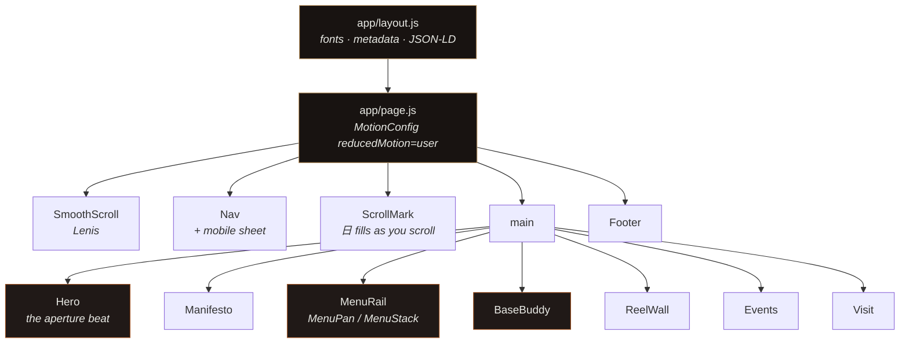

Shared helpers worth knowing:

| File | Job |
|---|---|
| [`components/Reveal.jsx`](components/Reveal.jsx) | `MaskLine` and `Rise` — every scroll reveal on the page |
| [`components/Poster.jsx`](components/Poster.jsx) | lazy `<picture>` underlay, AVIF → WebP → JPEG |
| [`components/useLazyVideo.js`](components/useLazyVideo.js) | IntersectionObserver playback; pauses offscreen |
| [`components/useReducedMotionSafe.js`](components/useReducedMotionSafe.js) | `matchMedia` read *after* mount, so SSR matches |
| [`lib/data.js`](lib/data.js) | all content — the single place copy lives |

### Request path in production

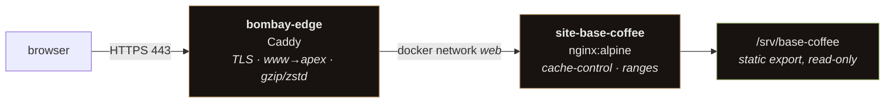

Caching, set in `/srv/_sites/base-coffee.nginx.conf` on the box:

| Path | `Cache-Control` | Why |
|---|---|---|
| `/_next/static/` | `max-age=31536000, immutable` | filenames carry a content hash |
| `/media/`, `/posters/` | `max-age=2592000` | replaced only by a redeploy |
| `/` | `max-age=0, must-revalidate` | otherwise a redeploy never reaches anyone |

`accept-ranges: bytes` is preserved throughout so video seeking works.

---

## Performance

Lighthouse against production, desktop preset:

| Metric | Before | After |
|---|---:|---:|
| **Performance** | 61 | **98** |
| Accessibility | 96 | 96 |
| Best Practices | 96 | **100** |
| SEO | 100 | **100** |
| Cumulative Layout Shift | 0.446 | **0** |
| Total Blocking Time | 280 ms | **20 ms** |
| Speed Index | 2.9 s | **1.5 s** |
| Largest Contentful Paint | 0.8 s | **0.7 s** |

Mobile: **Performance 78 · Accessibility 100 · Best Practices 100 · SEO 100 · CLS 0.**

### The two fixes that mattered

**CLS 0.446 → 0** — the hero aperture, rewritten from animated `left/top/width/height`
on a div to animated `<rect>`s inside one SVG. See [Hero aperture](#1--hero-aperture).

**On-load 4.19 MB → 1.98 MB** — a `<video poster>` is fetched eagerly no matter
where the element sits on the page, so 16 reel tiles pulled ~2.3 MB of JPEG before
the visitor had scrolled at all. Replaced with a lazy `` underlay inside
`<picture>`, shipping AVIF at **77% smaller** than the JPEGs.

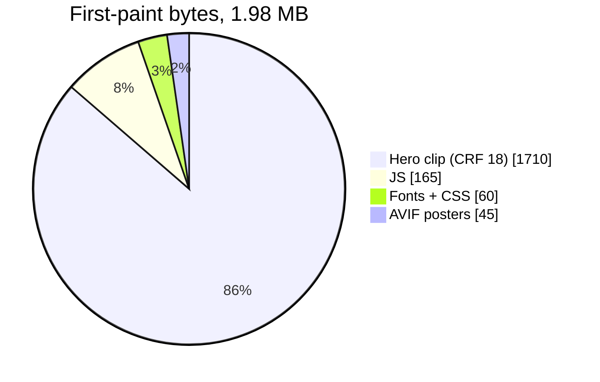

### The 4K ceiling — read this before filing a bug

**The hero cannot be crisp on a 4K display, and no encoder setting will fix it.**

Instagram serves these clips at 720×1280. Displayed full-bleed at 3840px that is a
**5.33× upscale**. Sharpening and a lanczos pre-upscale were both measured against
native; the gain is small, because no encoder invents detail that Instagram already
discarded.

| Source | Upscale to 3840px | Result |
|---|---|---|
| 720p *(what Instagram gives)* | 5.33× | soft |
| 1080p | 3.55× | acceptable |
| 4K | 1.78× | crisp |

The only real fix is **original footage from the café** — they shot it on a phone,
Instagram is what compressed it. A mild unsharp (0.6) is baked in as mitigation.

---

## What is deliberately absent

Two omissions are load-bearing. Please do not "fix" them.

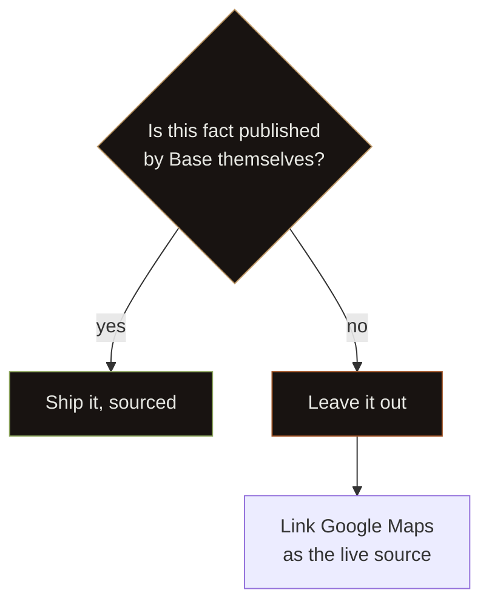

**No prices, anywhere.** Base has never published them. A wrong price on what
reads as their official site is worse than a missing one. Tracked in
[#1](https://github.com/Piyushmishra29/base-coffee/issues/1) — blocked on the client.

**Hours are shown, but not in the JSON-LD.** They *were* published — post
`DLR72xgsH4W`, 24 Jun 2025: *"Pouring everyday: 8am - 10pm"* — so the Visit section
states them with a Maps link beside it. They are kept out of the structured data
deliberately: schema hours are machine-authoritative and Google would surface a
14-month-old line over whatever the business has since set in Maps. A stale closing
time sends someone to a shut door.

---

## Running it

```bash
npm install
npm run dev          # http://localhost:3060
npm run build        # static export to ./out
```

Regenerating assets:

```bash
python3 tools/transcode.py --src <dir-of-original-downloads>
python3 tools/images.py      # AVIF + WebP for every jpg; fails loudly if any is missing
```

---

## Deploying

Built with **no `basePath`** — it targets a custom domain, so the tailnet
`/base-coffee/` path preview renders unstyled by design.

```bash
npm run build
rsync -az --delete ./out/ root@<vps>:/srv/base-coffee/
```

No restart needed; nginx serves the directory read-only.

---

## Traps worth knowing

Each of these cost real debugging time here.

| Trap | What happens | Fix |
|---|---|---|
| `npm run build` while `next dev` runs | build wipes `.next`, dev server serves a completely **unstyled page** — looks exactly like a broken CSS bug | kill dev, build, restart dev |
| `whileInView` on a masked element | element parked at `y: 115%` is clipped by its own `overflow:hidden`, IntersectionObserver reports zero intersection, it **never animates in** | trigger on the outer, unclipped wrapper — see `Reveal.jsx` |
| `useReducedMotion()` during render | reads `matchMedia` on the client but not the server → hydration mismatch | `useReducedMotionSafe` returns false until mounted |
| CSS `prefers-reduced-motion` block | does **not** stop motion's JS animations | `<MotionConfig reducedMotion="user">` |
| `<picture>` with a missing `<source>` | selects by MIME type and **will not fall back** on 404 → permanently broken image | `tools/images.py` guarantees every sibling exists |
| `autoPlay` + `preload="none"` | autoplay forces the fetch; `preload` is ignored | play from an IntersectionObserver |
| `new Date()` in a static export | baked at build time, re-evaluated in browser → React #418 after New Year | `suppressHydrationWarning` |
| Animating `left/top/width/height` | reflows every frame **and** scores as layout shift | animate SVG geometry, or transforms |

---

<div align="center">

*Crafting moments, one cup at a time.*

</div>
